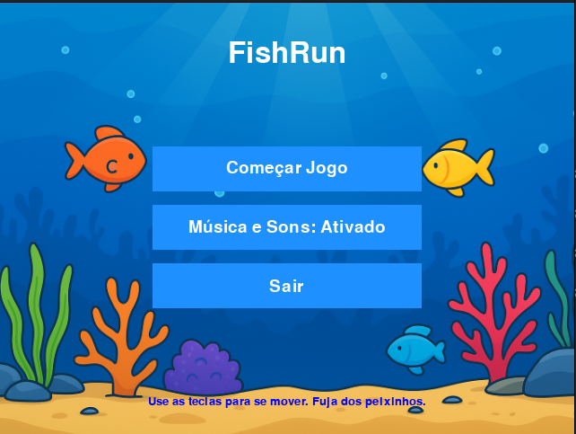
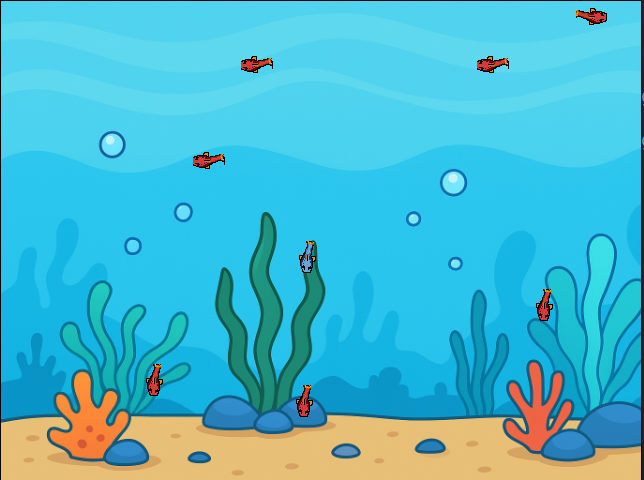

# 🐟 FishRun

FishRun é um pequeno jogo desenvolvido em **Python** usando o **Pygame Zero**, criado especialmente para um **teste técnico da Koadland**.  
O objetivo é simples: **mova seu peixinho azul e fuja dos peixes vermelhos!**  
O projeto demonstra lógica de movimentação em grid, animações suaves, sistema de menus e gerenciamento de estados de jogo (menu, jogando e game over).

---

## 🎮 Funcionalidades

- 🧭 **Movimentação em grid** com animação suave.  
- 💥 **Detecção de colisões** entre o herói e os inimigos.  
- 🧠 **IA básica de inimigos** — patrulham uma área e perseguem o jogador se ele se aproximar.  
- 🎵 **Sistema de som e música**, com opção de ativar/desativar.  
- 🖱️ **Botões interativos** com detecção de hover e som de clique.  
- 🏁 **Estados de jogo completos**:
  - Menu inicial  
  - Tela de jogo  
  - Tela de “Game Over”

---

## 🧩 Tecnologias utilizadas

- **Python 3.10+**  
- **Pygame Zero** (para renderização, entrada e sons)  
- **Bibliotecas padrão**: `math`, `random`

---

## 🛠️ Pré-requisitos

Antes de rodar o jogo, é necessário ter o **Python** e o **Pygame Zero** instalados.

### 1. Instalar Python
Baixe e instale o Python pelo site oficial:  
👉 [https://www.python.org/downloads/](https://www.python.org/downloads/)

### 2. Instalar o Pygame Zero
No terminal, execute:
```bash
pip install pgzero
```

---

## 🚀 Como rodar o jogo

1. **Baixe ou clone o projeto:**
   ```bash
   git clone https://github.com/seuusuario/fishrun.git
   cd fishrun
   ```

2. **Coloque os arquivos de imagem e som** nas pastas corretas:
   ```
   fishrun/
   ├── main.py
   ├── images/
   │   ├── homebg.png
   │   ├── gamebg.png
   │   ├── blue_down_normal.png
   │   ├── blue_down_fishing.png
   │   ├── red_left_normal.png
   │   └── ... (demais sprites)
   └── sounds/
       ├── menu.ogg
       ├── game.ogg
       ├── game_over.ogg
       └── click.wav
   ```

3. **Execute o jogo com o comando:**
   ```bash
   pgzrun main.py
   ```

4. 🎉 **Jogue e divirta-se!**

---

## 🕹️ Controles

| Tecla | Ação |
|-------|------|
| ⬅️ | Move para a esquerda |
| ➡️ | Move para a direita |
| ⬆️ | Move para cima |
| ⬇️ | Move para baixo |

---

## 📜 Estrutura do código

| Seção | Descrição |
|-------|------------|
| `Button` | Classe responsável pelos botões do menu e game over. |
| `SpriteCharacter` | Classe base para todos os personagens (herói e inimigos). |
| `Hero` | Controla o personagem principal (peixe azul). |
| `Enemy` | Define o comportamento dos inimigos (peixes vermelhos). |
| `update()` | Atualiza o estado do jogo a cada frame. |
| `draw()` | Renderiza os elementos na tela. |
| `handle_input()` | Trata o movimento do jogador. |
| `check_collisions()` | Detecta colisões entre o herói e os inimigos. |
| `make_menu()`, `start_game()`, `make_game_over()` | Funções que gerenciam os estados do jogo. |

---

## 🧠 Lógica do jogo

- O **herói** (peixe azul) começa no centro do grid.  
- Os **inimigos** (peixes vermelhos) aparecem em posições aleatórias, mas sempre longe do herói.  
- Cada inimigo tem um **raio de patrulha** e alterna entre estados de patrulha e perseguição.  
- Se um inimigo colidir com o herói, o jogador perde vida.  
- Ao perder todas as vidas, o jogo muda para o estado **Game Over**.

---

## 🔊 Áudio

O jogo contém três faixas sonoras principais:
- **menu.ogg** → música do menu inicial  
- **game.ogg** → música durante o jogo  
- **game_over.ogg** → som ao perder  
Além disso, o **som de clique (click.wav)** é tocado em cada botão.

Você pode **ativar ou desativar** os sons clicando no botão “Música e Sons” no menu.

---

## 💡 Créditos

Desenvolvido por **Pedro Emanuel Ribeiro dos Santos**  
para o **teste técnico da Koadland** 🎯  
Usando **Python** e **Pygame Zero** 🐍

---

## 📷 Preview



